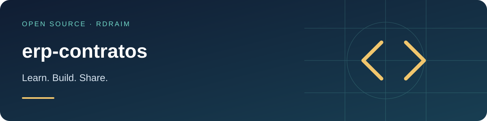

<p align="right">
  <a href="README.md"></a>
  <a href="README.en-US.md"></a>
  <a href="README.es-AR.md"></a>
</p>

# erp-contratos



[](LICENSE) [](https://github.com/Rdraim/erp-contratos/actions) [](https://github.com/Rdraim/erp-contratos/releases) [](https://github.com/Rdraim/erp-contratos/commits/main) [](https://github.com/Rdraim/erp-contratos/stargazers) [](https://github.com/Rdraim/erp-contratos/forks)

<p>
  <a href="https://github.com/Rdraim/erp-contratos/tree/main/examples"></a>
  <a href="https://github.dev/Rdraim/erp-contratos"></a>
  <a href="https://github.com/Rdraim/erp-contratos/archive/refs/heads/main.zip"></a>
</p>


Separate integration contracts from transport and deduplicate concurrent operations.

## Installation

```bash
git clone https://github.com/Rdraim/erp-contratos.git
cd erp-contratos
npm test
node examples/basic.mjs
```

## Runnable example

```js
import {criarExecutor, validarEnvelope} from './src/index.js';
console.log(await criarExecutor({executar:async e=>({recebido:e.id})})({versao:1,id:'exemplo-1',tipo:'cadastro',dados:{codigo:'A'}}));
```

## API

`validarEnvelope({versao:1,id,tipo,dados})` validates and clones an envelope. `criarExecutor({executar, capacidade:1000})` returns an async function that reuses results for the same id/content and rejects conflicts. Failed attempts can retry.

## Limits

Process-local in-memory deduplication, not exactly-once delivery or a distributed transaction. No vendor endpoint or credentials. Production needs durable storage and recipient-side idempotency. Capacity exhaustion rejects new operations without silently forgetting previous ones.

## Compatibility

No runtime dependencies in the core. CI targets Node.js 22 and 24. Install from Git; this project is not published on npm. Review Releases and pin a tag/commit for integration. Dependency updates require license, engine and consumer test review. A CI badge is not a security certification.

[Compatibility](COMPATIBILITY.en-US.md) · [Contributing](CONTRIBUTING.en-US.md) · [Security](SECURITY.en-US.md)

MIT © Rodrigo Rodrigues

## ☕ Buy me a coffee

Did this project help you solve a problem, learn something new, or take your first steps in development? If you feel like supporting my work, a coffee is a kind way to say thank you.

I’m **Rodrigo Rodrigues**, creator of **Nexus** and these open source projects. Your support helps me set aside time to improve the code, write clearer examples, and keep sharing what I learn.

**Give any amount that feels right to you. Supporting is completely optional — the project remains free under the MIT license.**

<p>
  <a href="#support-via-pix"></a>
  <a href="https://github.com/techrodrigo21-ux/erp-contratos/issues/new?title=Feedback%3A%20this%20project%20helped%20me"></a>
</p>

### Support via Pix

In your banking app, scan the QR code or copy the Pix key below. Choose your amount and check the recipient details before confirming.

<p align="center">
  
</p>

**Pix key**

```text
8875a24e-44d1-4c91-b6bb-62c9f0070955
```

Pix is Brazil’s payment system. If your bank does not support it, you can still help by sharing the project, reporting a bug, improving the documentation, or leaving feedback.

### Your feedback matters, too

[Tell me how the project helped you](https://github.com/techrodrigo21-ux/erp-contratos/issues/new?title=Feedback%3A%20this%20project%20helped%20me). I’d love to hear what you built, what you learned, and what could be clearer for someone just starting out.

A comment is welcome with or without a donation. Please keep payment receipts, personal details, credentials and private user data out of public Issues.

---

**Thank you for supporting my work and helping me keep building and sharing. ❤️**
